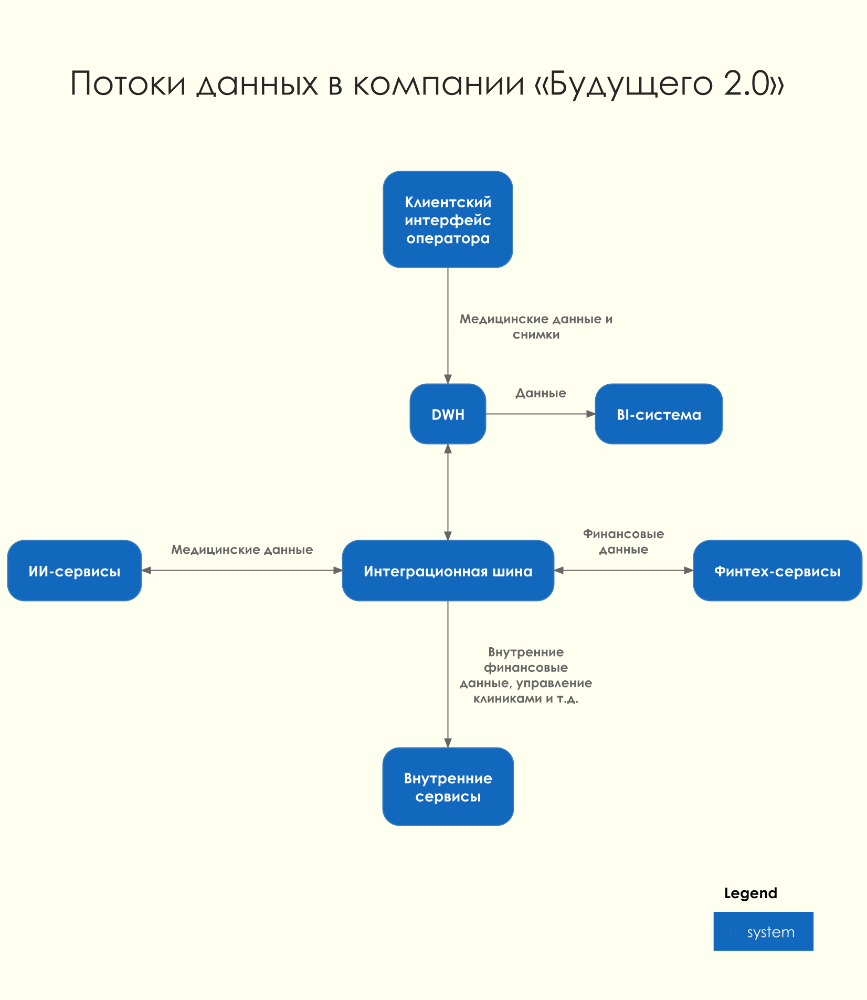

# Сдача проектной работы 11 спринта

В этом спринте вы будете работать над кейсом компании «Будущее 2.0».

# О компании

Компания «Будущее 2.0» начинала как медицинский стартап, а со временем выросла в успешный бизнес. Сегодня её врачи используют современное оборудование и системы искусственного интеллекта для постановки диагнозов и назначения лечения. А недавно компания купила банк, чтобы дополнить свои медицинские услуги финансовыми сервисами. В ближайших планах — интегрировать в экосистему нескольких фармацевтических компаний и производителя электроники для медицинского оборудования.  

Изначально все корпоративные данные в «Будущем 2.0» хранились в DWH, построенном на базе SQL Server. В нём была реализована значительная часть бизнес-логики, а для работы операторов в клиниках использовался интерфейс на PowerBuilder.

В DWH лежат:

- Данные по клиентам.
- Медицинские карты и истории болезни, в том числе данные исследований, включая результаты диагностических исследований, проведённых в ходе лечения.
- Финансовая история.
- Счета.
- Данные о кредитах.
- Данные по персоналу больницы.
- Данные по инвентаризации.
- Финансовая отчётность и много другой информации.

«Будущее 2.0» хочет развивать каждое из своих направлений отдельно, сохраняя при этом целостное представление по ключевым бизнес-показателям. Однако уже сейчас построение необходимой отчётности занимает слишком много времени. Объём данных измеряется сотнями терабайт, а сценариев их использования — невероятное множество, что приводит к большому количеству трансформаций. В результате замедляется time-to-market и падает производительность аналитических процессов: формирование сложных отчётов может занимать часы.  

В ближайшее время компания «Будущее 2.0» планирует перенести основную часть своего IT-ландшафта в облачную инфраструктуру. Этот шаг позволит быстрее масштабировать ресурсы для работы с данными и гибко подключать новые бизнес-направления, а также сократит затраты на поддержку устаревшего оборудования. В облаке предполагается выстраивать отдельные среды для разных доменов, чтобы обеспечить их независимость и упростить развитие.

Переезд в облако также рассматривается как способ повысить надёжность и доступность сервисов. Для критичных систем будут использоваться механизмы отказоустойчивости, резервного копирования и геораспределённого развёртывания. При этом ключевой задачей останется обеспечение информационной безопасности и соблюдение требований регуляторов, особенно в части работы с медицинскими и финансовыми данными.

## Что нужно сделать

Руководство «Будущего 2.0» поставило перед командой две задачи:

- **Создать удобную «витрину данных»** — портала самообслуживания, который можно легко масштабировать вне зависимости от количества бизнес-направлений и их целей. Планируется, что сотрудник сможет получить в этой системе отчёт по любым необходимым срезам в пределах своего уровня доступа, а также конструировать собственные отчёты. Важно подчеркнуть, что в «витрину данных» не будут включаться медицинские карты, истории болезней и результаты медицинских исследований. Эти данные компания не предполагает использовать для аналитики.
- **Предоставить архитектурное решение по изменению IТ-ландшафта в области работы с данными.** Оно должно обеспечить интеграцию новых бизнес-направлений без необходимости вносить значительные объёмы бизнес-логики в DWH.
Бизнес разрешил при необходимости отказаться от легаси-систем и мигрировать на новые сервисы, если вы предоставите весомое обоснование.

## Лендскейп компании

### В структуре компании есть четыре подразделения:

- Головной офис;
- Клиники;
- Компания, предоставляющая ИИ-сервисы для работы с медицинскими данными;
- Компания, оказывающая финтех-услуги и обладающая банковской лицензией.

### В рамках проектной работы будет необходимо работать с такими продуктами:

- Финтех-сервисами;
- Внутренней медицинской системой (DWH) с клиентским интерфейсом и дополнительной бизнес-логикой под финтех и ИИ-сервисы;
- BI-системой с большим количеством кастомизаций поверх DWH;
- ИИ-сервисами для работы с медицинскими данными;
- Интеграционным слоем через старую шину данных.

### Сейчас в «Будущем 2.0» развёрнуты следующие технологии, сервисы и приложения:

- DWH на базе Microsoft SQL-сервера 2008 года;
- Power BI;
- Power Builder;
- Шина на базе Apache Camel;
- ИИ-сервисы на Python;
- Финтех-сервисы на Golang и Java.

### Так выглядят потоки данных в компании «Будущего 2.0»:

[future-2.0-data-flow.png]([future-2.0-data-flow.puml)



## Цели бизнеса

### Промежуточное состояние (через пару месяцев)

- Архитектурное решение по трансформации сформировано и согласовано.
- Границы доменов определены, а ключевые связи между ними описаны.
- В доменах запланированы конкретные проекты по развитию «витрины данных».

### Финальное состояние (через год)

- Реализован портал самообслуживания.
- Бизнес-пользователи в доменах могут работать с данными в рамках новой архитектуры.
- На этом этапе допускается временное сохранение легаси-систем в отдельных доменах.

# Как подготовиться к работе

Подготовьте репозиторий, куда вы будете загружать решения заданий:

- Проект этого спринта вы будете сдавать в Git-репозитории. Создайте публичный репозиторий в GitHub или GitLab. Назовите его «architecture-future_2_0».
- Проект состоит из четырёх заданий. Решение каждого задания нужно будет залить в отдельную директорию. Создайте в репозитории четыре директории и назовите их «Task1», «Task2», «Task3» и «Task4».
- Чтобы ревьюеру было проще проверять вашу работу, а вам отслеживать изменения на разных итерациях, загрузите файлы в свой репозиторий и сделайте пул-реквест. На ревью нужно отправить ссылку на пул-реквест.

Если репозиторий готов, то можно приступать к заданиям!

# Задание 1. Проектирование целевой архитектуры и приоритизация проблем для поддержки ключевых бизнес-сценариев компании

- Спроектируйте архитектуру системы для «Будущего 2.0» через год. Составьте диаграмму контейнеров в модели C4. На диаграмме отметьте, как целевая архитектура будет поддерживать ключевые бизнес-сценарии компании. Например, быстрая подготовка отчётности, независимое развитие финтех- и ИИ-направлений, масштабирование для новых бизнесов.
- Опишите проблемные места. Сделайте это в удобной для вас форме (список или таблица). Обязательно укажите, какие бизнес-сценарии страдают от этих проблем. Скажем, из-за того, что отчёт строится часами, появляются задержки в принятии управленческих решений).
- Приоритизируйте выявленные проблемы. Для этого используйте методы, которые вы уже изучили на курсе (MoSCoW, матрица Эйзенхауэра). Приоритизацию свяжите с целями бизнеса (что критично для выручки, скорости выхода на рынок, качества медицинских или финансовых сервисов).

Когда задание будет готово, загрузите диаграмму, анализ проблемных мест и их приоритизацию в директорию Task1 в рамках пул-реквеста.

# Задание 2. Разделение системы на домены и моделирование потоков данных для поддержки ключевых бизнес-сценариев

- Разделите систему на домены, чтобы их можно было развивать независимо без необходимости внедрять новую логику в DWH. Обоснуйте это разделение, опираясь на бизнес-сценарии: определите, какие домены нужны для поддержки клиники, финтех- и ИИ-сервисов и будущих партнёров (фармацевтика, электроника).
- Отразите потоки данных между доменами. Для этого отрисуйте Data Flow Diagram и отразите на ней, как бизнес-сценарии (например, интеграция нового финтех-сервиса или использование ИИ для анализа медицинских данных) будут обеспечены потоками данных.
- Аргументируйте логику разделения на домены. Опишите преимущества для бизнеса: ускорение вывода продуктов, снижение зависимости от DWH, возможность отдельного развития направлений.

Когда задание будет готово, загрузите DFD и свою аргументацию в директорию Task2 в рамках пул-реквеста.

# Задание 3. Разработка технологического радара и роадмапа изменений для поддержки бизнес-целей компании

- Сформируйте технический радар, на котором отразите как текущие технологии и методологии, так и предлагаемые изменения с сопутствующими инструментами. Для каждой технологии укажите, какие бизнес-сценарии он поддерживает. Например, облачные сервисы для масштабирования отчётности или Data Mesh для интеграции новых бизнесов.
- Составьте роадмап, в котором будут отражены изменения в технологическом ландшафте компании с привязкой этапов к бизнес-целям. В нём необходимо обозначить шаги, требуемые для запуска портала самообслуживания, проекты, обеспечивающие независимое развитие подразделений, а также меры, критически важные для поддержания качества медицинских и финансовых сервисов. Для каждого этапа укажите ожидаемые результаты, ответственные команды и необходимые ресурсы.
- Обоснуйте планируемые изменения, пояснив, зачем нужен каждый этап с точки зрения бизнеса. Укажите, как он влияет на скорость принятия решений, качество сервиса, снижение затрат или возможности масштабирования.

Когда задание будет готово, загрузите техрадар, роадмап и аргументацию в директорию Task3 в рамках пул-реквеста.

# Задание 4. Проектирование облачной инфраструктуры с применением IaaS и Terraform 1.

- Создайте диаграмму автоматизации развёртывания. Подготовьте компонентную схему и укажите на ней, какие компоненты (VM, Disk, Network и т. д.) будут управляться Terraform, а какие разворачиваются вручную.
- Создайте Terraform-конфигурацию на основе информации из диаграммы. Конфигурация должна автоматизировать развёртывание всех указанных компонентов, учитывая их взаимосвязи и требования к инфраструктуре.

    Создайте рабочий проект, который будет в себя включать:

    - main.tf — описание инфраструктуры;
    - variables.tf — определение переменных;
    - outputs.tf — вывод ключевых параметров;
    - terraform.tfvars — значения переменных.

    ```
    /Task4/
    ├── main.tf
    ├── variables.tf
    ├── outputs.tf
    ├── terraform.tfvars
    └── diagram.png (Диаграмма автоматизации развёртывания) 
    ```
- Протестируйте подготовленные скрипты, выполнив команды terraform init, terraform plan и terraform apply. Убедитесь, что инфраструктура создана успешно, и сделайте скриншот результата выполнения команды apply, который необходимо включить в пул-реквест.
- Обоснуйте конфигурацию. Для этого напишите текстовый файл justification.md, в котором нужно пояснить выбор ресурсов и параметров, включая размер виртуальных машин, дисков и настройки NAT, указать причины использования декларативного подхода, а также описать, как подход Infrastructure as Code (IaC) способствует воспроизводимости и масштабируемости инфраструктуры.
Когда задание будет готово, загрузите конфигурацию Terraform и диаграмму автоматизации развёртывания в директорию Task4 в рамках пул-реквеста.

# Как сдать работу

В начале работы у вас должен быть Git-репозиторий «architecture-future_2_0», в котором есть четыре пустые директории. Чтобы сдать своё решение на проверку, вам нужно сделать пул-реквест, который будет содержать все изменения.

В директории Task1 должна лежать диаграмма контейнеров, а также анализ проблемных мест с их приоритизацией.

В директории Task2 должны лежать DFD и обоснование разделения архитектуры на домены.

В директории Task3 должны быть техрадар, роадмап и обоснование для каждого этапа изменений.

В директории Task4 должны быть конфигурации Terraform и диаграмма автоматизации развёртывания.

Перед отправкой работы убедитесь, что вы сделали пул-реквест в собственный репозиторий, а не в репозиторий Практикума. Вставьте ссылку на пул-реквест во вкладке «Ревью».

После того как отправите ссылку, не вносите изменения в проект. Сдайте проект и дождитесь комментариев ревьюера.

# На что будет смотреть ревьюер

Ревьюер не примет работу, если она не будет соответствовать требованиям:

- Репозиторий с решением публичный. Перед отправкой убедитесь, что репозиторий в вашем GitHub публичный. Иначе ревьюер не сможет проверить работу.
- В работе нет вопросов к ревьюеру по условиям задания. Если у вас возникнут вопросы по проектной работе, обратитесь к наставнику в Пачке — он вам поможет. Ревьюер проверяет уже готовое решение.
- Если вы повторно отправляете проект на ревью, замечания ревьюера с прошлой проверки учтены и исправлены.