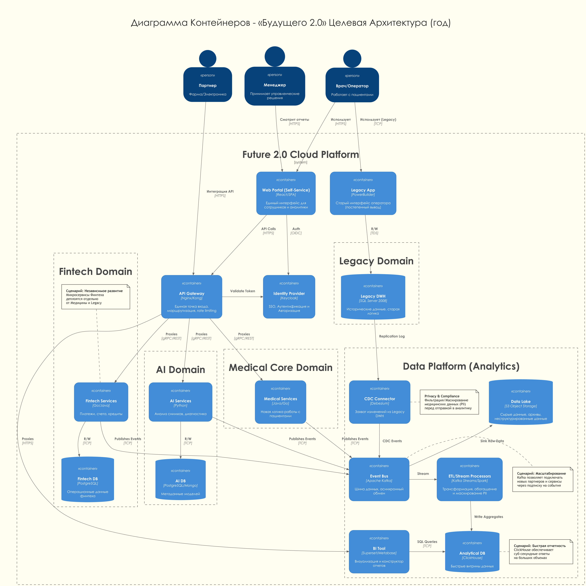

# Задание 1. Проектирование целевой архитектуры

## Диаграмма контейнеров (C4 Container)

Целевая архитектура (через 1 год) спроектирована для поддержки ключевых бизнес-сценариев: быстрая отчетность, независимое развитие доменов и масштабируемость.

---

# Анализ проблемных мест и приоритизация

## 1. Выявленные проблемы и их влияние на бизнес-сценарии

| Проблема | Описание | Влияние на бизнес-сценарии |
| :--- | :--- | :--- |
| **Монолитный DWH (SQL Server 2008)** | Вся бизнес-логика и данные сосредоточены в одной устаревшей базе данных. Сложно масштабировать, единая точка отказа. | **Быстрая подготовка отчетности**: Отчеты строятся часами из-за перегрузки БД, что блокирует принятие решений.   **Масштабирование**: Невозможно гибко подключать новые направления без риска отказа всей системы. |
| **Бизнес-логика в слое хранения (Stored Procedures)** | Логика "зашита" в БД. Изменения требуют участия DBA, сложно тестировать, высокий риск регрессии. | **Независимое развитие**: Финтех и ИИ зависят от общего релизного цикла монолита.   **Time-to-market**: Медленное внедрение изменений замедляет вывод новых продуктов. |
| **Отсутствие витрины данных (Self-Service)** | Пользователи не могут сами строить отчеты, зависят от IT-отдела. | **Быстрая подготовка отчетности**: Высокая нагрузка на IT, задержки в получении данных для бизнеса. |
| **Устаревший стек интеграции (PowerBuilder, Legacy Bus)** | Жесткие связи, синхронные вызовы, сложность поддержки устаревших клиентов. | **Интеграция новых бизнесов**: Сложно и дорого подключать партнеров (Фарма, Электроника) к устаревшим интерфейсам. |
| **Ручное управление инфраструктурой** | Отсутствие автоматизации (IaC), долгий процесс выделения ресурсов. | **Масштабирование**: Замедляет развертывание сред для новых команд и сервисов, повышает риск ошибок конфигурации ("configuration drift"). |

## 2. Приоритизация (MoSCoW)

### Must Have (Критично для запуска и целей бизнеса)
- **Создание Data Lakehouse (S3 + ClickHouse)**: Необходимо для решения проблемы медленных отчетов (снижение с часов до минут/секунд). Прямо влияет на качество управления.
- **Реализация Витрины данных (Self-Service BI)**: Обеспечивает доступность данных для бизнес-пользователей без участия разработчиков.
- **Разделение на домены (Decoupling)**: Выделение Финтеха и ИИ в отдельные контуры для обеспечения их независимого развития и деплоя.
- **Внедрение Event-Driven архитектуры (Kafka)**: Для развязывания сервисов и обеспечения асинхронного обмена данными между доменами.

### Should Have (Важно, но можно реализовать во вторую очередь)
- **Миграция Legacy-интерфейсов (PowerBuilder) на Web**: Важно для удобства, но на первом этапе можно использовать существующие приложения через VPN/VDI.
- **Полная автоматизация Infrastructure as Code**: Критично для стабильности, но на этапе MVP допустима частичная автоматизация.
- **Интеграция с внешними партнерами (Фарма, Электроника)**: Запланировано в стратегии, но требует сначала готовности внутренней платформы.

### Could Have (Желательно, если останутся ресурсы)
- **Real-time аналитика**: Для большинства текущих отчетов достаточно обновления раз в 15-30 минут (Near Real-time).
- **Продвинутые ML-модели в проде**: Запуск сложных моделей можно отложить до накопления данных в новом озере.

### Won't Have (Не будет реализовано в ближайший год)
- **Полный отказ от SQL Server 2008**: Он останется как источник данных (Legacy Core) на период переходного этапа (Strangler Fig pattern).

## 3. Обоснование приоритетов

- **Скорость принятия решений (Выручка)**: Текущая ситуация с отчетами (часы ожидания) недопустима. Поэтому **Data Lakehouse** и **BI-витрина** имеют наивысший приоритет. Это "узкое горлышко" текущего бизнеса.
- **Time-to-Market (Конкурентоспособность)**: Чтобы Финтех и ИИ могли развиваться и конкурировать на рынке, их нужно "отвязать" от монолита. Разделение на домены - критический шаг для выполнения стратегии компании.
- **Надежность и Безопасность**: Переход в облако и сегментация сетей (разделение медицинских и финансовых данных) необходимы для соблюдения регуляторных требований (152-ФЗ, PCI DSS) при масштабировании.
