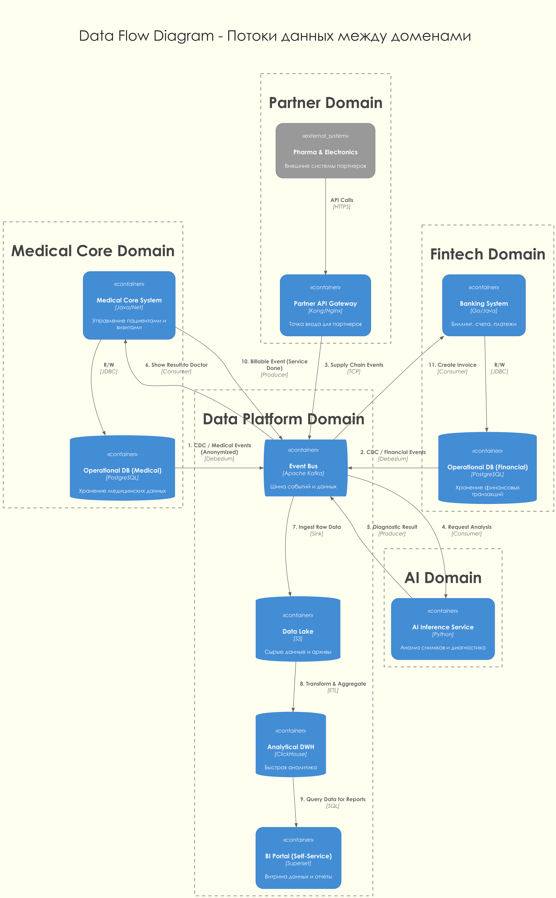

# Задание 2. Разделение системы на домены и моделирование потоков данных

## 1. Разделение системы на домены

Для обеспечения независимого развития бизнес-направлений и ухода от монолитного DWH предлагается выделить следующие предметные области (домены):

### 1. Домен "Клиника" (Medical Core Domain)
- **Ответственность:** Управление пациентами, ведение электронных медицинских карт (EMR), расписание врачей, проведение медицинских исследований.
- **Ключевые сущности:** Пациент, Врач, Визит, Диагноз, Медицинская услуга.
- **Обоснование:** Это ядро медицинского бизнеса. Выделение в отдельный домен позволяет изолировать чувствительные медицинские данные (врачебная тайна) и развивать интерфейсы для врачей независимо от банка.

### 2. Домен "Финтех" (Fintech Domain)
- **Ответственность:** Банковское обслуживание, платежи, кредитование, выставление счетов (биллинг), страхование.
- **Ключевые сущности:** Счет, Транзакция, Кредитный договор, Платеж.
- **Обоснование:** Финтех имеет специфические требования к безопасности (PCI DSS) и регуляторике, отличные от медицины. Независимый релизный цикл критичен для быстрого вывода новых финансовых продуктов.

### 3. Домен "Искусственный Интеллект" (AI & Diagnostic Domain)
- **Ответственность:** Анализ медицинских изображений, поддержка принятия врачебных решений, предиктивная аналитика.
- **Ключевые сущности:** Модель ML, Датасет, Результат диагностики.
- **Обоснование:** ИИ-сервисы требуют специфической инфраструктуры (GPU) и жизненного цикла (обучение -> валидация -> деплой). Они выступают как "сервис" для клиники, не блокируя её работу.

### 4. Домен "Платформа Данных и Аналитики" (Data Platform & Analytics Domain)
- **Ответственность:** Сбор, хранение и аналитика данных. Реализация "Витрины данных" (Self-Service BI).
- **Ключевые сущности:** Data Lake, Витрины (Data Marts), Отчеты, Дашборды.
- **Обоснование:** Централизованная точка правды для управленческой отчетности. Позволяет строить отчеты, не нагружая операционные системы (Клинику и Финтех). Именно здесь реализуется требование "портала самообслуживания".

### 5. Домен "Партнерская Интеграция" (Partner Ecosystem Domain)
- **Ответственность:** Взаимодействие с внешними партнерами (Фармацевтика, Электроника).
- **Ключевые сущности:** Заказ поставщику, Статус поставки, Данные от устройств.
- **Обоснование:** Изолирует внутренний контур от внешнего мира. Позволяет безопасно подключать новых партнеров через стандартизированные API.

---

## 2. Моделирование потоков данных

Ниже представлена диаграмма потоков данных, демонстрирующая взаимодействие доменов через событийную модель (Event-Driven) и ETL-процессы.

### Data Flow Diagram

[Data Flow Diagram - PlantUML](data_flow.puml)

### Описание ключевых потоков данных:

1.  **Интеграция Финтех-сервиса (Сценарий: Оплата услуг):**

    - В домене **Клиника** фиксируется факт оказания услуги. Событие `ServiceCompleted` публикуется в **Kafka**.
    - Домен **Финтех** подписывается на это событие и автоматически генерирует счет (Invoice).
    - Данные о транзакции сохраняются в операционной БД Финтеха и асинхронно отправляются в **Data Lake** для отчетности.

    *Преимущество:* Клиника не знает о деталях реализации биллинга.

2.  **Использование ИИ (Сценарий: Диагностика):**

    - Врач загружает снимок в **Клинике**. Система отправляет событие `ImageUploaded` (с ссылкой на обезличенный снимок) в шину.
    - **ИИ-сервис** получает событие, скачивает снимок, проводит анализ и публикует событие `AnalysisCompleted`.
    - **Клиника** получает результат и отображает его врачу.

    *Преимущество:* Тяжелые вычисления вынесены из медицинского ядра. Можно легко менять модели ИИ.

3.  **Построение отчетности (Сценарий: Витрина данных):**

    - Все домены (Клиника, Финтех, Партнеры) стримят изменения данных (CDC) или бизнес-события в **Data Lake**.
    - Данные трансформируются и загружаются в быстрый аналитический движок (**ClickHouse**).
    - Бизнес-пользователи через **BI-портал** строят отчеты по любым срезам (выручка по клиникам, эффективность ИИ и т.д.), не нагружая операционные системы.

---

## 3. Аргументация логики разделения

Выбранная архитектура решает поставленные бизнес-задачи следующим образом:

### 1. Ускорение вывода продуктов (Time-to-Market)
- **Проблема:** Ранее любое изменение требовало правки монолитного DWH и хранимых процедур.
- **Решение:** Теперь команда Финтеха может выпускать новые кредитные продукты, меняя только свой микросервис и свою БД. Им не нужно согласовывать схему данных с врачами. Интеграция идет через контракт событий (Kafka).

### 2. Снижение зависимости от DWH
- **Проблема:** DWH был "бутылочным горлышком", выполняя роль и хранилища, и шины, и бэкенда.
- **Решение:** DWH (в виде Data Platform) теперь занимается *только* аналитикой. Операционная логика вынесена в доменные сервисы. Если аналитика "упадет", клиника продолжит принимать пациентов, а банк - проводить платежи.

### 3. Возможность отдельного развития направлений
- **Масштабируемость:** Можно масштабировать ИИ-кластер (добавлять GPU) независимо от учетной системы клиники.
- **Технологическая свобода:** Финтех может писать на Golang/Java, ИИ на Python, а Клиника оставаться на .NET или мигрировать постепенно. Нет привязки к единому стеку SQL Server.

### 4. Поддержка новых партнеров
- Выделенный домен интеграции позволяет подключать Фарму и Электронику через стандартные API, не пуская их во внутреннюю сеть и базы данных, что критично для безопасности.
