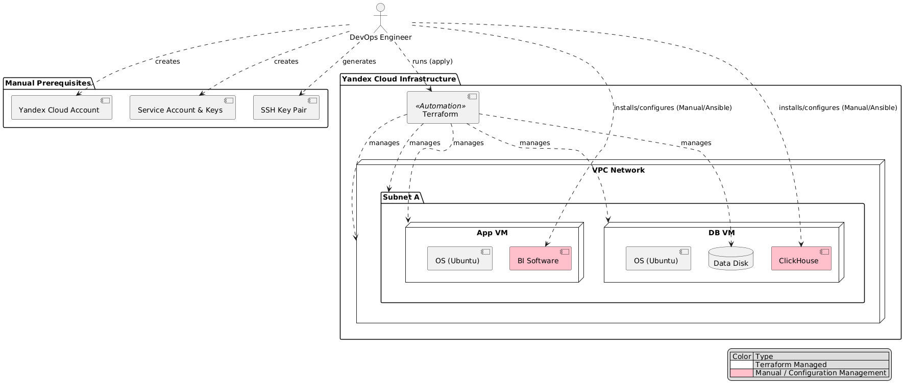

# Задание 4. Проектирование облачной инфраструктуры с применением IaaS и Terraform

## Состав задания
В этой директории находятся файлы решения:

1.  **Terraform конфигурация:**
    - `main.tf` - описание ресурсов (VPC, Subnet, VMs, Disks).
    - `variables.tf` - описание переменных.
    - `outputs.tf` - выходные параметры.
    - `terraform.tfvars.example` - пример значений переменных (разумеется, реальный файл я в репозиторий не положил).
    - `justification.md` - обоснование выбора конфигурации.
    - `terraform.rc` - конфигурация зеркала провайдеров (для решения проблем с доступом к registry.terraform.io).

2.  **Диаграмма:**

    

## Как запустить

Для запуска Terraform через Docker выполните следующие команды (находясь в директории `task4`):

**Важно:** Если вы находитесь в РФ или испытываете проблемы с доступом к `registry.terraform.io` (ошибка `Invalid provider registry host`), используйте флаг `-e TF_CLI_CONFIG_FILE=/workspace/terraform.rc` во всех командах.

1.  **Инициализация:**
    ```bash
    docker run --rm -v .:/workspace -w /workspace -e TF_CLI_CONFIG_FILE=/workspace/terraform.rc hashicorp/terraform:latest init
    ```

    Пример вывода:

    ```
    $ docker run --rm -e TF_CLI_CONFIG_FILE=/workspace/terraform.rc -v .:/workspace -w /workspace hashicorp/terraform:latest init
    Initializing the backend...
    Initializing provider plugins...
    - Reusing previous version of yandex-cloud/yandex from the dependency lock file
    - Using previously-installed yandex-cloud/yandex v0.184.0

    Terraform has been successfully initialized!

    You may now begin working with Terraform. Try running "terraform plan" to see
    any changes that are required for your infrastructure. All Terraform commands
    should now work.

    If you ever set or change modules or backend configuration for Terraform,
    rerun this command to reinitialize your working directory. If you forget, other
    commands will detect it and remind you to do so if necessary.
    ```

2.  **Валидация конфигурации:**
    ```bash
    docker run --rm -v .:/workspace -w /workspace -e TF_CLI_CONFIG_FILE=/workspace/terraform.rc hashicorp/terraform:latest validate
    ```

    Пример вывода:

    ```
    $ docker run --rm -e TF_CLI_CONFIG_FILE=/workspace/terraform.rc -v .:/workspace -w /workspace -e TF_CLI_CONFIG_FILE=/workspace/terraform.rc hashicorp/terraform:latest validate
    Success! The configuration is valid.
    ```

3.  **Планирование (требуется токен Yandex Cloud):**
    Необходимо передать токен через переменную окружения `YC_TOKEN`.
    ```bash
    # Windows (PowerShell)
    $env:YC_TOKEN = (yc iam create-token)
    docker run --rm -v .:/workspace -w /workspace -e TF_CLI_CONFIG_FILE=/workspace/terraform.rc -e YC_TOKEN=$env:YC_TOKEN hashicorp/terraform:latest plan

    # Linux/macOS/Git Bash
    export YC_TOKEN=$(yc iam create-token)
    docker run --rm -v .:/workspace -w /workspace -e TF_CLI_CONFIG_FILE=/workspace/terraform.rc -e YC_TOKEN=$YC_TOKEN hashicorp/terraform:latest plan
    ```

    Пример вывода:

    ```
    $ docker run --rm -e TF_CLI_CONFIG_FILE=/workspace/terraform.rc -v .:/workspace -w /workspace -e TF_CLI_CONFIG_FILE=/workspace/terraform.rc -e YC_TOKEN=%YC_TOKEN% hashicorp/terraform:latest plan
    yandex_compute_disk.db_data_disk: Refreshing state... [id=fhmuc0da61b9v3i4n28u]
    yandex_vpc_network.future_net: Refreshing state... [id=enpcg2f88fdmno8rm9sh]
    yandex_vpc_subnet.future_subnet: Refreshing state... [id=e9bkdcjljorod2enru94]
    yandex_compute_instance.app_vm: Refreshing state... [id=fhmeu92o8a5qmm66usf8]
    yandex_compute_instance.db_vm: Refreshing state... [id=fhm57vr92vsbq98tnl20]

    Note: Objects have changed outside of Terraform

    Terraform detected the following changes made outside of Terraform since the
    last "terraform apply" which may have affected this plan:

      # yandex_compute_disk.db_data_disk has been deleted
      - resource "yandex_compute_disk" "db_data_disk" {
          - id          = "fhmuc0da61b9v3i4n28u" -> null
            name        = "db-data-disk"
            # (11 unchanged attributes hidden)

            # (2 unchanged blocks hidden)
        }

      # yandex_compute_instance.app_vm has been deleted
      - resource "yandex_compute_instance" "app_vm" {
            id                        = "fhmeu92o8a5qmm66usf8"
            name                      = "app-server-1"
            # (14 unchanged attributes hidden)

          - network_interface {
              - ip_address     = "192.168.10.30" -> null
              - nat_ip_address = "51.250.67.132" -> null
                # (8 unchanged attributes hidden)
            }

            # (5 unchanged blocks hidden)
        }

      # yandex_compute_instance.db_vm has been deleted
      - resource "yandex_compute_instance" "db_vm" {
            id                        = "fhm57vr92vsbq98tnl20"
            name                      = "db-server-1"
            # (14 unchanged attributes hidden)

          - network_interface {
              - ip_address     = "192.168.10.16" -> null
                # (9 unchanged attributes hidden)
            }

            # (6 unchanged blocks hidden)
        }

      # yandex_vpc_network.future_net has been deleted
      - resource "yandex_vpc_network" "future_net" {
          - id                        = "enpcg2f88fdmno8rm9sh" -> null
            name                      = "future-network"
            # (6 unchanged attributes hidden)
        }

      # yandex_vpc_subnet.future_subnet has been deleted
      - resource "yandex_vpc_subnet" "future_subnet" {
          - id             = "e9bkdcjljorod2enru94" -> null
            name           = "future-subnet-a"
            # (9 unchanged attributes hidden)
        }


    Unless you have made equivalent changes to your configuration, or ignored the
    relevant attributes using ignore_changes, the following plan may include
    actions to undo or respond to these changes.

    ─────────────────────────────────────────────────────────────────────────────

    Terraform used the selected providers to generate the following execution
    plan. Resource actions are indicated with the following symbols:
      + create

    Terraform will perform the following actions:

      # yandex_compute_disk.db_data_disk will be created
      + resource "yandex_compute_disk" "db_data_disk" {
          + block_size  = 4096
          + created_at  = (known after apply)
          + folder_id   = (known after apply)
          + id          = (known after apply)
          + name        = "db-data-disk"
          + product_ids = (known after apply)
          + size        = 100
          + status      = (known after apply)
          + type        = "network-hdd"
          + zone        = "ru-central1-a"

          + disk_placement_policy (known after apply)

          + hardware_generation (known after apply)
        }

      # yandex_compute_instance.app_vm will be created
      + resource "yandex_compute_instance" "app_vm" {
          + created_at                = (known after apply)
          + folder_id                 = (known after apply)
          + fqdn                      = (known after apply)
          + gpu_cluster_id            = (known after apply)
          + hardware_generation       = (known after apply)
          + hostname                  = (known after apply)
          + id                        = (known after apply)
          + maintenance_grace_period  = (known after apply)
          + maintenance_policy        = (known after apply)
          + metadata                  = {
              + "ssh-keys" = <<-EOT
                    ubuntu:ssh-rsa AAAAB3NzaC1yc2EAAAADAQABAAABgQC...dummy...key... wolde@osaka
                EOT
            }
          + name                      = "app-server-1"
          + network_acceleration_type = "standard"
          + platform_id               = "standard-v1"
          + status                    = (known after apply)
          + zone                      = "ru-central1-a"

          + boot_disk {
              + auto_delete = true
              + device_name = (known after apply)
              + disk_id     = (known after apply)
              + mode        = (known after apply)

              + initialize_params {
                  + block_size  = (known after apply)
                  + description = (known after apply)
                  + image_id    = "fd80mrhj8fl2oe87o4e1"
                  + name        = (known after apply)
                  + size        = 20
                  + snapshot_id = (known after apply)
                  + type        = "network-hdd"
                }
            }

          + metadata_options (known after apply)

          + network_interface {
              + index          = (known after apply)
              + ip_address     = (known after apply)
              + ipv4           = true
              + ipv6           = (known after apply)
              + ipv6_address   = (known after apply)
              + mac_address    = (known after apply)
              + nat            = true
              + nat_ip_address = (known after apply)
              + nat_ip_version = (known after apply)
              + subnet_id      = (known after apply)
            }

          + placement_policy (known after apply)

          + resources {
              + core_fraction = 100
              + cores         = 2
              + memory        = 4
            }

          + scheduling_policy (known after apply)
        }

      # yandex_compute_instance.db_vm will be created
      + resource "yandex_compute_instance" "db_vm" {
          + created_at                = (known after apply)
          + folder_id                 = (known after apply)
          + fqdn                      = (known after apply)
          + gpu_cluster_id            = (known after apply)
          + hardware_generation       = (known after apply)
          + hostname                  = (known after apply)
          + id                        = (known after apply)
          + maintenance_grace_period  = (known after apply)
          + maintenance_policy        = (known after apply)
          + metadata                  = {
              + "ssh-keys" = <<-EOT
                    ubuntu:ssh-rsa AAAAB3NzaC1yc2EAAAADAQABAAABgQC...dummy...key... wolde@osaka
                EOT
            }
          + name                      = "db-server-1"
          + network_acceleration_type = "standard"
          + platform_id               = "standard-v1"
          + status                    = (known after apply)
          + zone                      = "ru-central1-a"

          + boot_disk {
              + auto_delete = true
              + device_name = (known after apply)
              + disk_id     = (known after apply)
              + mode        = (known after apply)

              + initialize_params {
                  + block_size  = (known after apply)
                  + description = (known after apply)
                  + image_id    = "fd80mrhj8fl2oe87o4e1"
                  + name        = (known after apply)
                  + size        = 30
                  + snapshot_id = (known after apply)
                  + type        = "network-hdd"
                }
            }

          + metadata_options (known after apply)

          + network_interface {
              + index          = (known after apply)
              + ip_address     = (known after apply)
              + ipv4           = true
              + ipv6           = (known after apply)
              + ipv6_address   = (known after apply)
              + mac_address    = (known after apply)
              + nat            = false
              + nat_ip_address = (known after apply)
              + nat_ip_version = (known after apply)
              + subnet_id      = (known after apply)
            }

          + placement_policy (known after apply)

          + resources {
              + core_fraction = 100
              + cores         = 4
              + memory        = 8
            }

          + scheduling_policy (known after apply)

          + secondary_disk {
              + auto_delete = false
              + device_name = (known after apply)
              + disk_id     = (known after apply)
              + mode        = "READ_WRITE"
            }
        }

      # yandex_vpc_network.future_net will be created
      + resource "yandex_vpc_network" "future_net" {
          + created_at                = (known after apply)
          + default_security_group_id = (known after apply)
          + folder_id                 = (known after apply)
          + id                        = (known after apply)
          + labels                    = (known after apply)
          + name                      = "future-network"
          + subnet_ids                = (known after apply)
        }

      # yandex_vpc_subnet.future_subnet will be created
      + resource "yandex_vpc_subnet" "future_subnet" {
          + created_at     = (known after apply)
          + folder_id      = (known after apply)
          + id             = (known after apply)
          + labels         = (known after apply)
          + name           = "future-subnet-a"
          + network_id     = (known after apply)
          + v4_cidr_blocks = [
              + "192.168.10.0/24",
            ]
          + v6_cidr_blocks = (known after apply)
          + zone           = "ru-central1-a"
        }

    Plan: 5 to add, 0 to change, 0 to destroy.

    Changes to Outputs:
      ~ app_external_ip = "51.250.67.132" -> (known after apply)
      ~ app_internal_ip = "192.168.10.30" -> (known after apply)
      ~ db_internal_ip  = "192.168.10.16" -> (known after apply)

    ─────────────────────────────────────────────────────────────────────────────

    Note: You didn't use the -out option to save this plan, so Terraform can't
    guarantee to take exactly these actions if you run "terraform apply" now.
    ```

4.  **Применение:**
    ```bash
    # Windows (PowerShell)
    docker run --rm -v .:/workspace -w /workspace -e TF_CLI_CONFIG_FILE=/workspace/terraform.rc -e YC_TOKEN=$env:YC_TOKEN hashicorp/terraform:latest apply -auto-approve

    # Linux/macOS/Git Bash
    docker run --rm -v .:/workspace -w /workspace -e TF_CLI_CONFIG_FILE=/workspace/terraform.rc -e YC_TOKEN=$YC_TOKEN hashicorp/terraform:latest apply -auto-approve
    ```

    Пример вывода:

    ```
    $ docker run --rm -e TF_CLI_CONFIG_FILE=/workspace/terraform.rc -v .:/workspace -w /workspace -e TF_CLI_CONFIG_FILE=/workspace/terraform.rc -e YC_TOKEN=%YC_TOKEN% hashicorp/terraform:latest apply -auto-approve
    yandex_compute_disk.db_data_disk: Refreshing state... [id=fhmuc0da61b9v3i4n28u]
    yandex_vpc_network.future_net: Refreshing state... [id=enpcg2f88fdmno8rm9sh]
    yandex_vpc_subnet.future_subnet: Refreshing state... [id=e9bkdcjljorod2enru94]
    yandex_compute_instance.app_vm: Refreshing state... [id=fhmeu92o8a5qmm66usf8]
    yandex_compute_instance.db_vm: Refreshing state... [id=fhm57vr92vsbq98tnl20]

    Note: Objects have changed outside of Terraform

    Terraform detected the following changes made outside of Terraform since the
    last "terraform apply" which may have affected this plan:

      # yandex_compute_disk.db_data_disk has been deleted
      - resource "yandex_compute_disk" "db_data_disk" {
          - id          = "fhmuc0da61b9v3i4n28u" -> null
            name        = "db-data-disk"
            # (11 unchanged attributes hidden)

            # (2 unchanged blocks hidden)
        }

      # yandex_compute_instance.app_vm has been deleted
      - resource "yandex_compute_instance" "app_vm" {
            id                        = "fhmeu92o8a5qmm66usf8"
            name                      = "app-server-1"
            # (14 unchanged attributes hidden)

          - network_interface {
              - ip_address     = "192.168.10.30" -> null
              - nat_ip_address = "51.250.67.132" -> null
                # (8 unchanged attributes hidden)
            }

            # (5 unchanged blocks hidden)
        }

      # yandex_compute_instance.db_vm has been deleted
      - resource "yandex_compute_instance" "db_vm" {
            id                        = "fhm57vr92vsbq98tnl20"
            name                      = "db-server-1"
            # (14 unchanged attributes hidden)

          - network_interface {
              - ip_address     = "192.168.10.16" -> null
                # (9 unchanged attributes hidden)
            }

            # (6 unchanged blocks hidden)
        }

      # yandex_vpc_network.future_net has been deleted
      - resource "yandex_vpc_network" "future_net" {
          - id                        = "enpcg2f88fdmno8rm9sh" -> null
            name                      = "future-network"
            # (6 unchanged attributes hidden)
        }

      # yandex_vpc_subnet.future_subnet has been deleted
      - resource "yandex_vpc_subnet" "future_subnet" {
          - id             = "e9bkdcjljorod2enru94" -> null
            name           = "future-subnet-a"
            # (9 unchanged attributes hidden)
        }


    Unless you have made equivalent changes to your configuration, or ignored the
    relevant attributes using ignore_changes, the following plan may include
    actions to undo or respond to these changes.

    ─────────────────────────────────────────────────────────────────────────────

    Terraform used the selected providers to generate the following execution
    plan. Resource actions are indicated with the following symbols:
      + create

    Terraform will perform the following actions:

      # yandex_compute_disk.db_data_disk will be created
      + resource "yandex_compute_disk" "db_data_disk" {
          + block_size  = 4096
          + created_at  = (known after apply)
          + folder_id   = (known after apply)
          + id          = (known after apply)
          + name        = "db-data-disk"
          + product_ids = (known after apply)
          + size        = 100
          + status      = (known after apply)
          + type        = "network-hdd"
          + zone        = "ru-central1-a"

          + disk_placement_policy (known after apply)

          + hardware_generation (known after apply)
        }

      # yandex_compute_instance.app_vm will be created
      + resource "yandex_compute_instance" "app_vm" {
          + created_at                = (known after apply)
          + folder_id                 = (known after apply)
          + fqdn                      = (known after apply)
          + gpu_cluster_id            = (known after apply)
          + hardware_generation       = (known after apply)
          + hostname                  = (known after apply)
          + id                        = (known after apply)
          + maintenance_grace_period  = (known after apply)
          + maintenance_policy        = (known after apply)
          + metadata                  = {
              + "ssh-keys" = <<-EOT
                    ubuntu:ssh-rsa AAAAB3NzaC1yc2EAAAADAQABAAABgQC...dummy...key... wolde@osaka
                EOT
            }
          + name                      = "app-server-1"
          + network_acceleration_type = "standard"
          + platform_id               = "standard-v1"
          + status                    = (known after apply)
          + zone                      = "ru-central1-a"

          + boot_disk {
              + auto_delete = true
              + device_name = (known after apply)
              + disk_id     = (known after apply)
              + mode        = (known after apply)

              + initialize_params {
                  + block_size  = (known after apply)
                  + description = (known after apply)
                  + image_id    = "fd80mrhj8fl2oe87o4e1"
                  + name        = (known after apply)
                  + size        = 20
                  + snapshot_id = (known after apply)
                  + type        = "network-hdd"
                }
            }

          + metadata_options (known after apply)

          + network_interface {
              + index          = (known after apply)
              + ip_address     = (known after apply)
              + ipv4           = true
              + ipv6           = (known after apply)
              + ipv6_address   = (known after apply)
              + mac_address    = (known after apply)
              + nat            = true
              + nat_ip_address = (known after apply)
              + nat_ip_version = (known after apply)
              + subnet_id      = (known after apply)
            }

          + placement_policy (known after apply)

          + resources {
              + core_fraction = 100
              + cores         = 2
              + memory        = 4
            }

          + scheduling_policy (known after apply)
        }

      # yandex_compute_instance.db_vm will be created
      + resource "yandex_compute_instance" "db_vm" {
          + created_at                = (known after apply)
          + folder_id                 = (known after apply)
          + fqdn                      = (known after apply)
          + gpu_cluster_id            = (known after apply)
          + hardware_generation       = (known after apply)
          + hostname                  = (known after apply)
          + id                        = (known after apply)
          + maintenance_grace_period  = (known after apply)
          + maintenance_policy        = (known after apply)
          + metadata                  = {
              + "ssh-keys" = <<-EOT
                    ubuntu:ssh-rsa AAAAB3NzaC1yc2EAAAADAQABAAABgQC...dummy...key... wolde@osaka
                EOT
            }
          + name                      = "db-server-1"
          + network_acceleration_type = "standard"
          + platform_id               = "standard-v1"
          + status                    = (known after apply)
          + zone                      = "ru-central1-a"

          + boot_disk {
              + auto_delete = true
              + device_name = (known after apply)
              + disk_id     = (known after apply)
              + mode        = (known after apply)

              + initialize_params {
                  + block_size  = (known after apply)
                  + description = (known after apply)
                  + image_id    = "fd80mrhj8fl2oe87o4e1"
                  + name        = (known after apply)
                  + size        = 30
                  + snapshot_id = (known after apply)
                  + type        = "network-hdd"
                }
            }

          + metadata_options (known after apply)

          + network_interface {
              + index          = (known after apply)
              + ip_address     = (known after apply)
              + ipv4           = true
              + ipv6           = (known after apply)
              + ipv6_address   = (known after apply)
              + mac_address    = (known after apply)
              + nat            = false
              + nat_ip_address = (known after apply)
              + nat_ip_version = (known after apply)
              + subnet_id      = (known after apply)
            }

          + placement_policy (known after apply)

          + resources {
              + core_fraction = 100
              + cores         = 4
              + memory        = 8
            }

          + scheduling_policy (known after apply)

          + secondary_disk {
              + auto_delete = false
              + device_name = (known after apply)
              + disk_id     = (known after apply)
              + mode        = "READ_WRITE"
            }
        }

      # yandex_vpc_network.future_net will be created
      + resource "yandex_vpc_network" "future_net" {
          + created_at                = (known after apply)
          + default_security_group_id = (known after apply)
          + folder_id                 = (known after apply)
          + id                        = (known after apply)
          + labels                    = (known after apply)
          + name                      = "future-network"
          + subnet_ids                = (known after apply)
        }

      # yandex_vpc_subnet.future_subnet will be created
      + resource "yandex_vpc_subnet" "future_subnet" {
          + created_at     = (known after apply)
          + folder_id      = (known after apply)
          + id             = (known after apply)
          + labels         = (known after apply)
          + name           = "future-subnet-a"
          + network_id     = (known after apply)
          + v4_cidr_blocks = [
              + "192.168.10.0/24",
            ]
          + v6_cidr_blocks = (known after apply)
          + zone           = "ru-central1-a"
        }

    Plan: 5 to add, 0 to change, 0 to destroy.

    Changes to Outputs:
      ~ app_external_ip = "51.250.67.132" -> (known after apply)
      ~ app_internal_ip = "192.168.10.30" -> (known after apply)
      ~ db_internal_ip  = "192.168.10.16" -> (known after apply)
    yandex_vpc_network.future_net: Creating...
    yandex_compute_disk.db_data_disk: Creating...
    yandex_vpc_network.future_net: Creation complete after 2s [id=enpv7in5ja1uhb1dped8]
    yandex_vpc_subnet.future_subnet: Creating...
    yandex_vpc_subnet.future_subnet: Creation complete after 0s [id=e9bv0rfmnj51nv47cv1e]
    yandex_compute_instance.app_vm: Creating...
    yandex_compute_disk.db_data_disk: Still creating... [00m10s elapsed]
    yandex_compute_disk.db_data_disk: Creation complete after 11s [id=fhmv2fq866nvujj9r4cu]
    yandex_compute_instance.db_vm: Creating...
    yandex_compute_instance.app_vm: Still creating... [00m10s elapsed]
    yandex_compute_instance.db_vm: Still creating... [00m10s elapsed]
    yandex_compute_instance.app_vm: Still creating... [00m20s elapsed]
    yandex_compute_instance.db_vm: Still creating... [00m20s elapsed]
    yandex_compute_instance.app_vm: Still creating... [00m30s elapsed]
    yandex_compute_instance.db_vm: Still creating... [00m30s elapsed]
    yandex_compute_instance.app_vm: Still creating... [00m40s elapsed]
    yandex_compute_instance.app_vm: Creation complete after 45s [id=fhmd24hgo741jr0scarf]
    yandex_compute_instance.db_vm: Still creating... [00m40s elapsed]
    yandex_compute_instance.db_vm: Still creating... [00m50s elapsed]
    yandex_compute_instance.db_vm: Creation complete after 56s [id=fhm8kocbfhc26l59srkb]

    Apply complete! Resources: 5 added, 0 changed, 0 destroyed.

    Outputs:

    app_external_ip = "62.84.125.26"
    app_internal_ip = "192.168.10.24"
    db_internal_ip = "192.168.10.12"
    ```

## Описание инфраструктуры

Разворачивается сегмент инфраструктуры для "Витрины данных":
*   **Сеть:** `future-network`
*   **Подсеть:** `future-subnet-a` (192.168.10.0/24)
*   **App Server:** VM (2 vCPU, 4GB RAM) с публичным IP для хостинга BI-системы.
*   **DB Server:** VM (4 vCPU, 8GB RAM) с дополнительным диском 100GB для ClickHouse. Доступ только внутри сети.

Подробное обоснование см. в файле `justification.md`.

## Работа с разными окружениями

Благодаря выносу параметров ресурсов в переменные (`variables.tf`), данную конфигурацию легко адаптировать под разные окружения (Dev, Stage, Prod) без изменения кода.

Для этого достаточно создать отдельные файлы значений переменных (`.tfvars`) основываясь на [terraform.tfvars.example](terraform.tfvars.example).

**Запуск с применением конкретного файла конфигурации:** Добавьте в параметры `terraform apply` параметр `-var-file="prod.tfvars"`

## Удаление ресурсов

Чтобы удалить все созданные ресурсы, выполните команду `destroy`:

```bash
# Windows (PowerShell)
docker run --rm -v .:/workspace -w /workspace -e TF_CLI_CONFIG_FILE=/workspace/terraform.rc -e YC_TOKEN=$env:YC_TOKEN hashicorp/terraform:latest destroy -auto-approve

# Linux/macOS/Git Bash
docker run --rm -v .:/workspace -w /workspace -e TF_CLI_CONFIG_FILE=/workspace/terraform.rc -e YC_TOKEN=$YC_TOKEN hashicorp/terraform:latest destroy -auto-approve
```

Пример вывода:

```
$ docker run --rm -e TF_CLI_CONFIG_FILE=/workspace/terraform.rc -v .:/workspace -w /workspace -e TF_CLI_CONFIG_FILE=/workspace/terraform.rc -e YC_TOKEN=%YC_TOKEN% hashicorp/terraform:latest destroy -auto-approve
yandex_vpc_network.future_net: Refreshing state... [id=enp39ocdfu7vgrch1aqp]
yandex_compute_disk.db_data_disk: Refreshing state... [id=fhm58565sfi5i2fh1b0r]
yandex_vpc_subnet.future_subnet: Refreshing state... [id=e9biln9lgec416hl3dmg]
yandex_compute_instance.db_vm: Refreshing state... [id=fhmgjd776515au0nh7ed]
yandex_compute_instance.app_vm: Refreshing state... [id=fhmos0ec4b158d13upf7]

Terraform used the selected providers to generate the following execution
plan. Resource actions are indicated with the following symbols:
  - destroy

Terraform will perform the following actions:

  # yandex_compute_disk.db_data_disk will be destroyed
  - resource "yandex_compute_disk" "db_data_disk" {
      - block_size  = 4096 -> null
      - created_at  = "2026-02-10T18:04:10Z" -> null
      - folder_id   = "b1g6l8icv5ar235474t4" -> null
      - id          = "fhm58565sfi5i2fh1b0r" -> null
      - labels      = {} -> null
      - name        = "db-data-disk" -> null
      - product_ids = [] -> null
      - size        = 100 -> null
      - status      = "ready" -> null
      - type        = "network-hdd" -> null
      - zone        = "ru-central1-a" -> null
        # (3 unchanged attributes hidden)

      - disk_placement_policy {
            # (1 unchanged attribute hidden)
        }

      - hardware_generation {
          - legacy_features {
              - pci_topology = "PCI_TOPOLOGY_V1" -> null
            }
        }
    }

  # yandex_compute_instance.app_vm will be destroyed
  - resource "yandex_compute_instance" "app_vm" {
      - created_at                = "2026-02-10T18:04:13Z" -> null
      - folder_id                 = "b1g6l8icv5ar235474t4" -> null
      - fqdn                      = "fhmos0ec4b158d13upf7.auto.internal" -> null
      - hardware_generation       = [
          - {
              - generation2_features = []
              - legacy_features      = [
                  - {
                      - pci_topology = "PCI_TOPOLOGY_V1"
                    },
                ]
            },
        ] -> null
      - id                        = "fhmos0ec4b158d13upf7" -> null
      - labels                    = {} -> null
      - metadata                  = {
          - "ssh-keys" = <<-EOT
                ubuntu:ssh-rsa AAAAB3NzaC1yc2EAAAADAQABAAABgQC...dummy...key... wolde@osaka
            EOT
        } -> null
      - name                      = "app-server-1" -> null
      - network_acceleration_type = "standard" -> null
      - platform_id               = "standard-v1" -> null
      - status                    = "running" -> null
      - zone                      = "ru-central1-a" -> null
        # (5 unchanged attributes hidden)

      - boot_disk {
          - auto_delete = true -> null
          - device_name = "fhmfqisk4rbs0nv4g8a7" -> null
          - disk_id     = "fhmfqisk4rbs0nv4g8a7" -> null
          - mode        = "READ_WRITE" -> null

          - initialize_params {
              - block_size  = 4096 -> null
              - image_id    = "fd80mrhj8fl2oe87o4e1" -> null
                name        = null
              - size        = 20 -> null
              - type        = "network-hdd" -> null
                # (3 unchanged attributes hidden)
            }
        }

      - metadata_options {
          - aws_v1_http_endpoint = 1 -> null
          - aws_v1_http_token    = 2 -> null
          - gce_http_endpoint    = 1 -> null
          - gce_http_token       = 1 -> null
        }

      - network_interface {
          - index              = 0 -> null
          - ip_address         = "192.168.10.9" -> null
          - ipv4               = true -> null
          - ipv6               = false -> null
          - mac_address        = "d0:0d:18:e0:1c:c2" -> null
          - nat                = true -> null
          - nat_ip_address     = "89.169.129.109" -> null
          - nat_ip_version     = "IPV4" -> null
          - security_group_ids = [] -> null
          - subnet_id          = "e9biln9lgec416hl3dmg" -> null
            # (1 unchanged attribute hidden)
        }

      - placement_policy {
          - host_affinity_rules       = [] -> null
          - placement_group_partition = 0 -> null
            # (1 unchanged attribute hidden)
        }

      - resources {
          - core_fraction = 100 -> null
          - cores         = 2 -> null
          - gpus          = 0 -> null
          - memory        = 4 -> null
        }

      - scheduling_policy {
          - preemptible = false -> null
        }
    }

  # yandex_compute_instance.db_vm will be destroyed
  - resource "yandex_compute_instance" "db_vm" {
      - created_at                = "2026-02-10T18:04:18Z" -> null
      - folder_id                 = "b1g6l8icv5ar235474t4" -> null
      - fqdn                      = "fhmgjd776515au0nh7ed.auto.internal" -> null
      - hardware_generation       = [
          - {
              - generation2_features = []
              - legacy_features      = [
                  - {
                      - pci_topology = "PCI_TOPOLOGY_V1"
                    },
                ]
            },
        ] -> null
      - id                        = "fhmgjd776515au0nh7ed" -> null
      - labels                    = {} -> null
      - metadata                  = {
          - "ssh-keys" = <<-EOT
                ubuntu:ssh-rsa AAAAB3NzaC1yc2EAAAADAQABAAABgQC...dummy...key... wolde@osaka
            EOT
        } -> null
      - name                      = "db-server-1" -> null
      - network_acceleration_type = "standard" -> null
      - platform_id               = "standard-v1" -> null
      - status                    = "running" -> null
      - zone                      = "ru-central1-a" -> null
        # (5 unchanged attributes hidden)

      - boot_disk {
          - auto_delete = true -> null
          - device_name = "fhmkmkmj0bhh8kfj89qd" -> null
          - disk_id     = "fhmkmkmj0bhh8kfj89qd" -> null
          - mode        = "READ_WRITE" -> null

          - initialize_params {
              - block_size  = 4096 -> null
              - image_id    = "fd80mrhj8fl2oe87o4e1" -> null
                name        = null
              - size        = 30 -> null
              - type        = "network-hdd" -> null
                # (3 unchanged attributes hidden)
            }
        }

      - metadata_options {
          - aws_v1_http_endpoint = 1 -> null
          - aws_v1_http_token    = 2 -> null
          - gce_http_endpoint    = 1 -> null
          - gce_http_token       = 1 -> null
        }

      - network_interface {
          - index              = 0 -> null
          - ip_address         = "192.168.10.28" -> null
          - ipv4               = true -> null
          - ipv6               = false -> null
          - mac_address        = "d0:0d:10:9b:4e:73" -> null
          - nat                = false -> null
          - security_group_ids = [] -> null
          - subnet_id          = "e9biln9lgec416hl3dmg" -> null
            # (3 unchanged attributes hidden)
        }

      - placement_policy {
          - host_affinity_rules       = [] -> null
          - placement_group_partition = 0 -> null
            # (1 unchanged attribute hidden)
        }

      - resources {
          - core_fraction = 100 -> null
          - cores         = 4 -> null
          - gpus          = 0 -> null
          - memory        = 8 -> null
        }

      - scheduling_policy {
          - preemptible = false -> null
        }

      - secondary_disk {
          - auto_delete = false -> null
          - device_name = "fhm58565sfi5i2fh1b0r" -> null
          - disk_id     = "fhm58565sfi5i2fh1b0r" -> null
          - mode        = "READ_WRITE" -> null
        }
    }

  # yandex_vpc_network.future_net will be destroyed
  - resource "yandex_vpc_network" "future_net" {
      - created_at                = "2026-02-10T18:04:10Z" -> null
      - default_security_group_id = "enp3dfp0at5g3btoavrm" -> null
      - folder_id                 = "b1g6l8icv5ar235474t4" -> null
      - id                        = "enp39ocdfu7vgrch1aqp" -> null
      - labels                    = {} -> null
      - name                      = "future-network" -> null
      - subnet_ids                = [
          - "e9biln9lgec416hl3dmg",
        ] -> null
        # (1 unchanged attribute hidden)
    }

  # yandex_vpc_subnet.future_subnet will be destroyed
  - resource "yandex_vpc_subnet" "future_subnet" {
      - created_at     = "2026-02-10T18:04:12Z" -> null
      - folder_id      = "b1g6l8icv5ar235474t4" -> null
      - id             = "e9biln9lgec416hl3dmg" -> null
      - labels         = {} -> null
      - name           = "future-subnet-a" -> null
      - network_id     = "enp39ocdfu7vgrch1aqp" -> null
      - v4_cidr_blocks = [
          - "192.168.10.0/24",
        ] -> null
      - v6_cidr_blocks = [] -> null
      - zone           = "ru-central1-a" -> null
        # (2 unchanged attributes hidden)
    }

Plan: 0 to add, 0 to change, 5 to destroy.

Changes to Outputs:
  - app_external_ip = "89.169.129.109" -> null
  - app_internal_ip = "192.168.10.9" -> null
  - db_internal_ip  = "192.168.10.28" -> null
yandex_compute_instance.db_vm: Destroying... [id=fhmgjd776515au0nh7ed]
yandex_compute_instance.app_vm: Destroying... [id=fhmos0ec4b158d13upf7]
yandex_compute_instance.db_vm: Still destroying... [id=fhmgjd776515au0nh7ed, 00m10s elapsed]
yandex_compute_instance.app_vm: Still destroying... [id=fhmos0ec4b158d13upf7, 00m10s elapsed]
yandex_compute_instance.db_vm: Still destroying... [id=fhmgjd776515au0nh7ed, 00m20s elapsed]
yandex_compute_instance.app_vm: Still destroying... [id=fhmos0ec4b158d13upf7, 00m20s elapsed]
yandex_compute_instance.db_vm: Still destroying... [id=fhmgjd776515au0nh7ed, 00m30s elapsed]
yandex_compute_instance.app_vm: Still destroying... [id=fhmos0ec4b158d13upf7, 00m30s elapsed]
yandex_compute_instance.app_vm: Destruction complete after 34s
yandex_compute_instance.db_vm: Destruction complete after 38s
yandex_compute_disk.db_data_disk: Destroying... [id=fhm58565sfi5i2fh1b0r]
yandex_vpc_subnet.future_subnet: Destroying... [id=e9biln9lgec416hl3dmg]
yandex_vpc_subnet.future_subnet: Destruction complete after 5s
yandex_vpc_network.future_net: Destroying... [id=enp39ocdfu7vgrch1aqp]
yandex_vpc_network.future_net: Destruction complete after 0s
yandex_compute_disk.db_data_disk: Still destroying... [id=fhm58565sfi5i2fh1b0r, 00m10s elapsed]
yandex_compute_disk.db_data_disk: Destruction complete after 10s

Destroy complete! Resources: 5 destroyed.
```